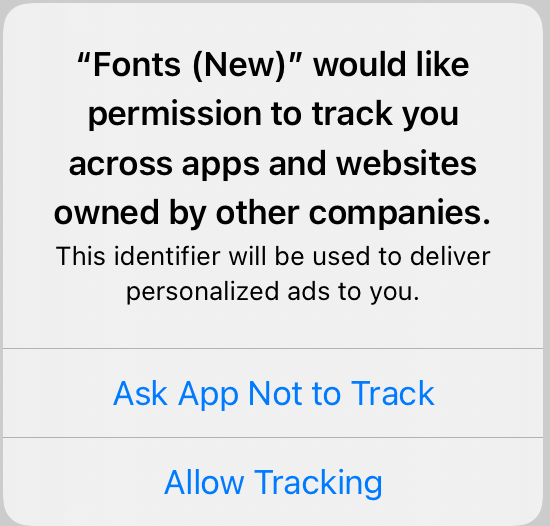
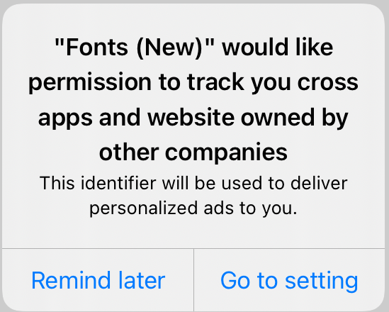

# App Tracking Transparency Guides

Starting in iOS 14, IDFA will be unavailable until an app calls the [App Tracking Transparency](https://developer.apple.com/documentation/apptrackingtransparency) framework to present the app-tracking authorization request to the end user. If an app does not present this request, the IDFA will automatically be zeroed out which may lead to a significant loss in ad revenue.

This guide outlines the changes needed for iOS 14 support.

## Prerequisites

Add [GMA](https://developers.google.com/admob/ios/quick-start) to Podfile.
Google Mobile Ads SDK 7.64.0 or higher

```bash
'Google-Mobile-Ads-SDK', '~> 7.64.0'
```

## Add info to Info.plist

```html
<key>NSUserTrackingUsageTitle</key>
<string>"$(PRODUCT_NAME)" would like permission to track you cross apps and website owned by other companies</string>
<key>NSUserTrackingUsageDescription</key>
<string>This identifier will be used to deliver personalized ads to you.</string>
```

<b>'NSUserTrackingUsageTitle'</b> and <b>'NSUserTrackingUsageDescription'</b> will be used for the tracking ads dialog and can its

## Usage

Now you can request tracking ads as follows:

```swift
import AppTrackingTransparency
import AdSupport
...
func requestIDFA() {
  ATTrackingManager.requestTrackingAuthorization(completionHandler: { status in
    // Tracking authorization completed. Start loading ads here.
    // loadAd()
  })
}
```


The problem is that the ATTrackingManager only shows a dialog once. If the user refuses you will lose a significant amount of revenue. You should show a dialog asking the user to access Settings to enable tracking when the user denies the first time.<br/>
And we have a complete class

```swift
import AppTrackingTransparency
import AdSupport
import UIKit

class Tracking {
    static func requestIDFA(parent: UIViewController) {
//        if isPremium {
//            return
//        }
        if #available(iOS 14, *) {
            ATTrackingManager.requestTrackingAuthorization(completionHandler: { status in
                switch status {
                case .denied:
                    print("Tracking denied. Show dialog setting now")
                    showDialogGoToTrackingSetting(parent: parent)
                case .notDetermined:
                    print("Tracking notDetermined")
                case .restricted:
                    print("Tracking restricted")
                case .authorized:
                    print("Tracking authorized")
                @unknown default:
                    break
                }
            })
        }
    }
    private static func showDialogGoToTrackingSetting(parent: UIViewController) {
        let title = Bundle.main.object(forInfoDictionaryKey: "NSUserTrackingUsageTitle") as? String ?? ""
        let message = Bundle.main.object(forInfoDictionaryKey: "NSUserTrackingUsageDescription") as? String ?? ""
        
        let alertVC = UIAlertController(title: title, message: message, preferredStyle: .alert)
        alertVC.addAction(UIAlertAction(title: "Remind later", style: .default, handler: { (alertController) -> Void in
            
        }))
        alertVC.addAction(UIAlertAction(title: "Go to setting", style: .default, handler: { (alertController) -> Void in
            UIApplication.shared.open(URL(string: UIApplication.openSettingsURLString)!, options: [:], completionHandler: nil)
        }))
        parent.present(alertVC, animated: true, completion: nil)
    }
}
```



Last call function in Main Viewcontroller
```swift
override func viewDidLoad() {
    super.viewDidLoad()
    Tracking.requestIDFA(parent: self)
}
```

## Enable SKAdNetwork to track conversions

Google is able to attribute an app install even when IDFA is unavailable. Để sử dụng được chức năng này, you will need to update the SKAdNetworkItems key with an additional dictionary in your Info.plist.

```html
<key>SKAdNetworkItems</key>
  <array>
    <dict>
      <key>SKAdNetworkIdentifier</key>
      <string>cstr6suwn9.skadnetwork</string>
    </dict>
  </array>
```

## License
[MIT](https://choosealicense.com/licenses/mit/)
